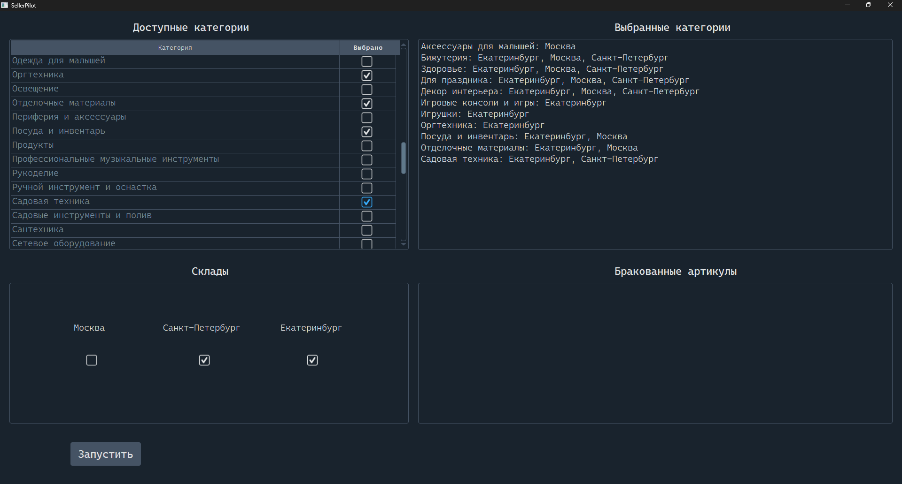

# 📦 Seller Pilot

Проект — автоматизатор переноса товаров из базы данных Seller Pilot в кабинет wildberries. Когда у вас сотни или тысячи позиций, ручной перенос превращается в часы монотонного кликанья: нужно отбирать товары по условиям, вручную указывать габариты и ждать после каждого импорта, чтобы не получить бан за повышенную активность

> _Проект выполнен в рамках коммерческого freelance-заказа. За 1.5 месяца поддержки потребовалось ~5 пакетов обновлений из-за постоянных изменений DOM на стороне Seller Pilot и доработки функционала. Планировался вывод продукта в production и монетизация, но инициатива была пресечена_

Программа полностью автоматизирует процесс и сочетает нестандартные решения для обхода ограничений:
1. Программа заходит в аккаунт, проверяет артикулы товаров на брак и отбирает товары. Чтобы обновить список без сброса примененных фильтров (что неизбежно при нажатии клавиши `f5`), программа устанавливает и снимает галочку чекбокса
2.  Браузер рендерит только видимые строки, по новой используя старые id элементов при прокрутке. Имитация скролла мышью рискованна (можно пропустить товары). Решение: программа считывает видимую область, сохраняет уникальные элементы в памяти и постепенно итерируется по ним
3. Конец динамически подгружаемой таблицы определяется не по счетчику элемента, а по истечению времени ожидания функции `WebDriverWait`. Ошибки сайта, скрытые в `shadow-root`, отслеживаются косвенно — через мониторинг изменений состояния адресной строки
4. При ошибках импорта товара на стороне Seller Pilot карточки остаются в открытом виде, их нужно как-то скрыть. Для этого необходимо кликнуть по пустому месту на экране, что нельзя сделать на selenium, т.к. нету элемента, к которому можно было бы привязаться. Решение - программно открывать и закрывать окно "Поддержка". Это позволяет сворачивать карточку товара

---

##  Стек технологий 

- **python 3.12** — основа проекта
- **selenium** — автоматизация браузера
- **pyqt6** + **qdarkstyle** — графический интерфейс с тёмной темой
- _(полный список зависимостей с версиями в `requirements.txt`)_

---

## Статистика проекта

| Показатель         | Значение                                                       |
| ------------------ | -------------------------------------------------------------- |
| SLOC python кода   | **1000+** (без учёта пробелов, комментариев, логов и конфигов) |
| Строк комментариев | **100+** (описание почти каждой функции и класса)              |
| Блоков логирования | **200+**                                                       |

---

## 🚀 Установка и запуск

**Вариант 1: Из исходного кода**
```bash
1 pip install -r requirements.txt
2 python main.py
```
**Вариант 2: Готовый билд** Скачайте архив из раздела **releases**, распакуйте и запустите `SellerPilot/pilot.exe`

---

## Архитектура

Проект построен на основе принципа разделения ответственности: каждый модуль отвечает за свою часть

```
SellerPilot/
├── main.py              # точка входа, оркестратор проекта, frontend
├── config.py            # загрузка путей к файлам из paths.json
├── paths.json           # конфигурация путей
├── requirements.txt     # зависимости
│
├── modules/             # backend
│   ├── authorization.py       # авторизация на сайте
│   ├── import_product.py      # импорт карточки товара
│   ├── set_prices.py          # установка фильтра по цене
│   ├── check_chekboxes.py     # фильтрование товаров чекбоксами
│   ├── install_remove_checkbox.py # обновление страницы без сброса фильтров
│   ├── select_combo_value.py  # выбор склада/категории
│   ├── search_element.py      # универсальный поиск элементов
│   ├── log.py                 # логирование
│   └── script.py              # оркестратор backend части
│
├── data/                # системные настройки и локаторы
│   ├── broken_articles.txt    # товары, которые не удалось импортировать
│   ├── locators.json          # данные о локаторах полей/кнопок
│   ├── log.json               # настройки логирования
│   └── progress.txt           # текущий прогресс работы
│
├── user_data/           # файлы для редактирования пользователем
│   ├── categories.txt         # список категорий товаров
│   ├── personal_data.json     # креды пользователя
│   └── settings.json          # настройка вводимых характеристик
│
└── logs/                # логи выполнения (новая папка на каждый день)
```

---
## Интерфейс программы



---
## 📽️ Пример работы программы
https://github.com/st0rmeed/SellerPilot/blob/master/gallery/pilot.mp4


